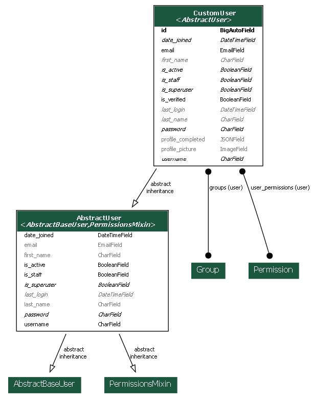
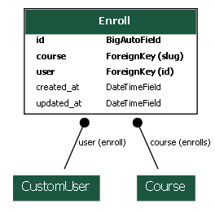
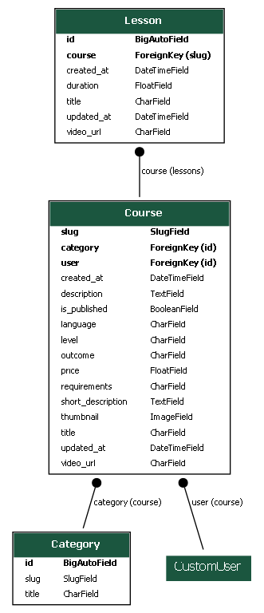
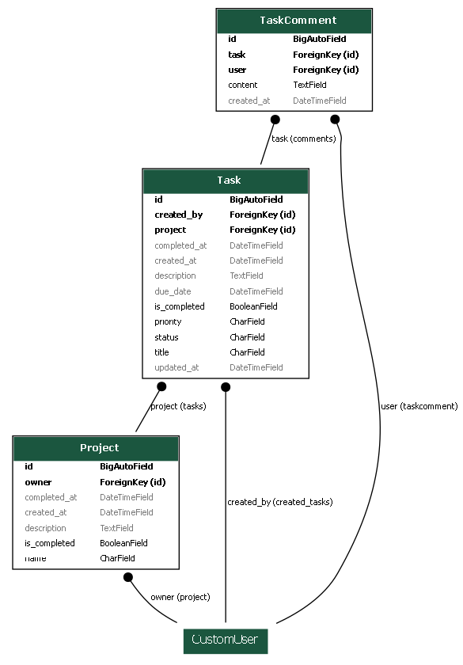
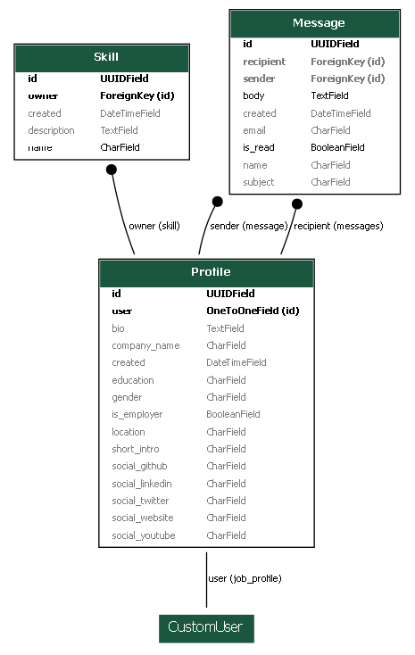
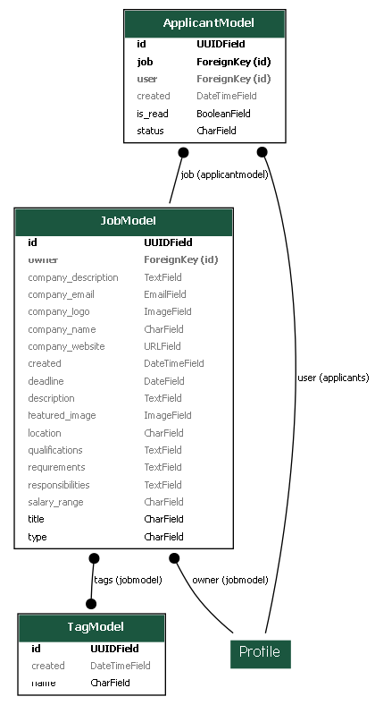
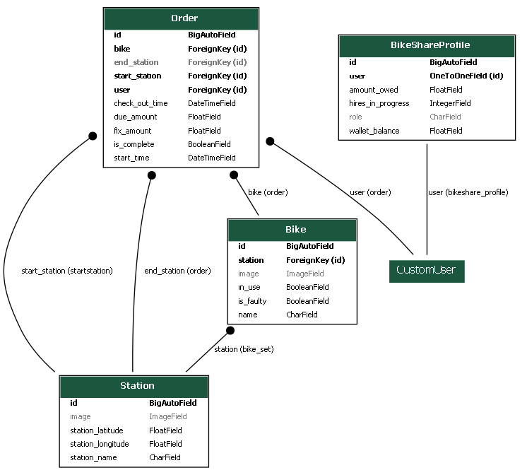
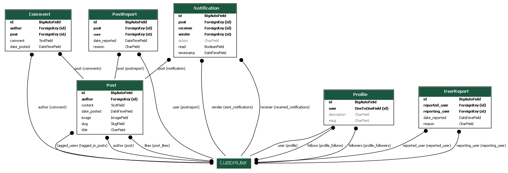
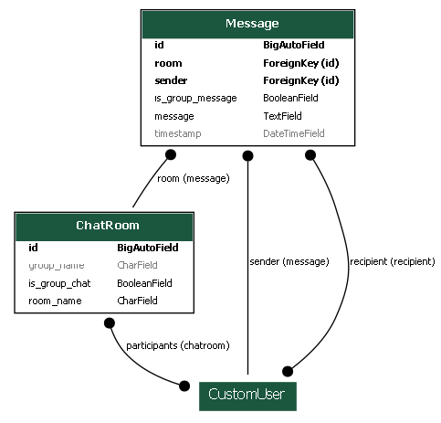

# VConnect - The Complete WebApp

## Table of Contents
0. Project WorkFlow
1. Introduction
2. System Overview
3. Technology Stack
4. Application Architecture 
5. Installation and Setup
6. Security Features
---

##  VConnect Platform - Basic Workflow

## Test Users
To explore the features of the platform, you can log in with the following test credentials:

- **Username:** jane_smith  
  **Password:** password123

- **Username:** john_doe  
  **Password:** password123

---

## Workflow Overview

### **User Authentication**
- Users can log in using their credentials or register with the required fields.  
- After registration, users can access basic features such as:
  - **SocialHub**
  - **Tasks**
  - **LearnHub**

> Note: The **News App** does not require user authentication and can be accessed publicly.

---

### **Homepage**
After successfully logging in, users are redirected to the homepage, which provides an overview of all services offered by the platform.  

#### Homepage Features:
- **Home Landing Page**  
  Highlights the key features and services available on VConnect.
- **About Page**  
  Provides detailed information about the platform.
- **Contact Page**  
  Allows users to get in touch with the VConnect team.
- **Navigation Bar with Dropdown Profile**  
  Users can access their profile and manage additional settings.

---

### **Accessing Advanced Features**
To access services like **CareerConnect** and **BikeShare**, users are required to fill in additional profile fields.

---

## Detailed Features

### **News App**
- Displays the latest tech news.
- Provides access to archived news for users interested in older updates.  
> No login required for this feature.

---

### **RideShare App**
This app provides bike-sharing and rental services.

#### User Roles:
1. **Customer**  
   - View, rent, and return bikes from various locations.
2. **Operator**  
   - Manage bike inventory and maintenance.
3. **Manager**  
   - Access statistics and analytics related to the bike-sharing business.

Users are prompted to select their role upon accessing the app.

---

### **CareerConnect App**
This app facilitates job-related services.

#### User Roles:
1. **Employee**  
   - View and apply for job positions.
2. **Employer**  
   - Post job listings and manage applications.

Users must select their role when redirected to the CareerConnect homepage.

---

### **LearnHub Platform**
- Offers a variety of courses in different categories.
- Users can:
  - View and add courses to their cart.
  - Check out and enroll in courses.
  - Access their enrolled courses through the navigation dropdown.
  - Progress through lessons in the enrolled courses.

---

### **SocialHub Platform**
This is the community network feature of VConnect.

#### Key Features:
- **Posting**  
  Users can create posts, including multimedia like photos.
- **Interactions**  
  Followers can view, like, and comment on posts.
- **Networking**  
  Users can follow others and view their profiles.
- **Messaging**  
  Users can send messages and receive notifications for interactions.
- **Profile Section**  
  Each user has a detailed profile displaying their followers and posts.
- **Notifications**  
  Notifications are accessible from the SocialHub navigation bar.

---

### **Global Navigation**
All services provided by the platform have a floating button located at the bottom left corner of the page. This button allows users to return to the main homepage of VConnect at any time.

---

This workflow ensures that users have a seamless and integrated experience while navigating through the VConnect platform. Enjoy exploring the features!

---

## 1. Introduction

VConnect is a comprehensive full-stack web platform that integrates multiple services including job searching, learning management, bike sharing, social networking, and task management. The platform is built using Django framework with a modular architecture consisting of twelve distinct applications.

### 1.1 Project Objectives
- Create a centralized platform for multiple user services
- Provide seamless integration between different modules
- Ensure secure user authentication and data management
- Enable real-time communication between users
- Facilitate community building and content sharing
---
## 2. System Overview

### 2.1 Core Features
- User authentication and profile management
- Job posting and application system
- Online learning platform with course management
- Bike sharing service
- Social networking capabilities
- Task management system
- Real-time chat functionality
- Tech news aggregation

### 2.2 User Roles
- Regular Users
- Employers
- Job Seekers
- Course Instructors
- Bike Share Operators
- System Administrators
---
## 3. Technology Stack

### 3.1 Backend
- Framework: Django
- Language: Python
- Database: sqllite
- Cache: Redis

### 3.2 Frontend
- HTML5
- CSS3
- JavaScript
- Bootstrap Framework

### 3.3 Development Tools
- Version Control: Git
- Cloud Platform: AWS/Azure
- IDE: VS Code
---
## 4. Application Architecture

### 4.1 Django Apps Structure and Class Diagrams

#### 4.1.1 Home App
- Primary landing page
- About section
- Contact information
- Navigation to other services

#### 4.1.2 Core App
Functions:
- User authentication (login/logout)
- User registration
- Profile management
- Password management
- Profile picture handling




#### 4.1.3 News App
Features:
- Tech news aggregation
- Article listing
- Detailed article view
- Archive access


#### 4.1.4 Learning Centre App
Components:
- Course catalog
- Course enrollment system
- Learning management
- Progress tracking




#### 4.1.5 Courses App
Features:
- Course categorization
- Detailed course views
- Lesson management
- Course search functionality




#### 4.1.6 Cart App
Functions:
- Shopping cart management
- Course purchase handling
- Checkout process
- Payment integration


#### 4.1.7 Tasks App
Features:
- Project creation and management
- Task assignment
- Priority setting
- Progress tracking
- Collaboration tools




#### 4.1.8 Job Profile App
Components:
- User type selection (employer/employee)
- Profile completion
- Skill management
- Messaging system




#### 4.1.9 Jobs App
Features:
- Job posting
- Job search
- Application management
- Employer dashboard
- Candidate tracking




#### 4.1.10 Bike Share App
Components:
- Station management
- Bike rental system
- Payment processing
- Maintenance reporting
- User balance management




#### 4.1.11 Social Hub App
Features:
- Post creation and management
- User following system
- Content interaction (likes/comments)
- Content reporting
- Notification system




#### 4.1.12 Chat App
Features:
- Real-time messaging
- Group chat creation
- Message history
- User status tracking



---
## 5. Installation and Setup

### 5.1 Prerequisites
```bash
Python 3.8+
Django 3.2+
Virtual Environment
Git
```

### 5.2 Installation Steps
1. Clone the repository
```bash
git clone https://github.com/venkideshVenu/VConnect---The-Complete-WebApp.git
cd VConnect
```

2. Create and activate virtual environment
```bash
python -m venv venv
source venv/bin/activate  # Linux/Mac
venv\Scripts\activate     # Windows
```

3. Install dependencies
```bash
pip install -r requirements.txt
```

4. Configure environment variables
```bash
cp .env.example .env
# Update .env with your configurations
```

5. Initialize database
```bash
python manage.py migrate
```

6. Create superuser
```bash
python manage.py createsuperuser
```

7. Run development server
```bash
python manage.py runserver
```
---

## 6. Security Features

### 6.1 Authentication
- Django's built-in authentication system
- Password hashing
- Session management
- CSRF protection

### 6.2 Authorization
- Role-based access control
- Permission management
- View-level security

### 6.3 Data Protection
- Form validation
- SQL injection prevention
- XSS protection
- Secure file uploads

---
